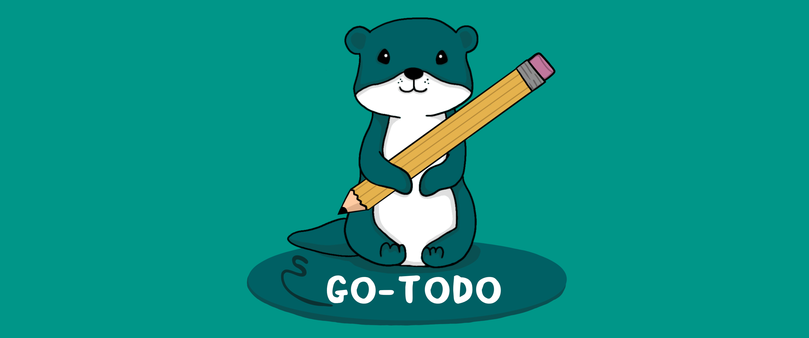

# Go-Todo application

This is the frontend application for the Go-Todo app. To use this, you will need
to have access to an instance of [Go-Todo backend](https://github.com/Ben-PP/go-todo-api).

## Getting Started

Before launching the frontend, make sure you have a backend also running for
development purposes. To develop this project, first start build_runner.

```bash
dart run build_runner watch -d --use-polling-watcher
```

After the build_runner is running, start flutter.

```bash
flutter run # Add '-d all' to run on all devices
```

# Special thanks

Thank you Ellida Tuominen for the Go-Todo logo/mascot!
